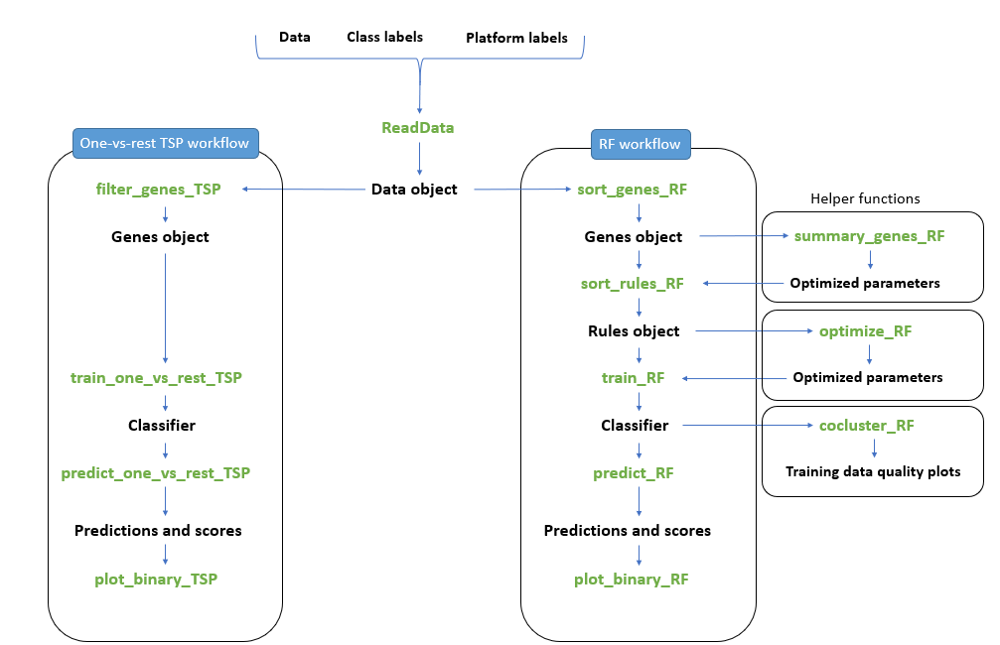
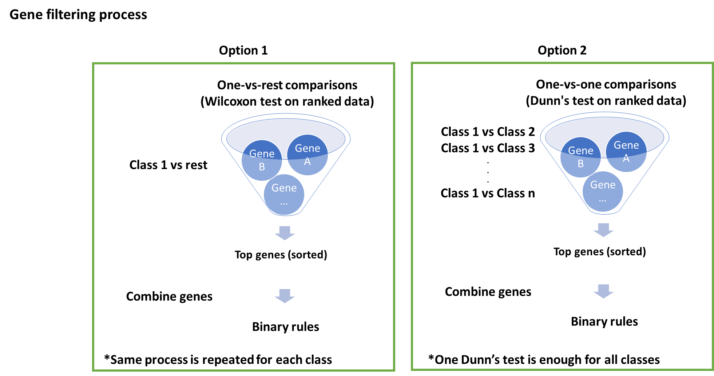

```{r setup, include=FALSE, echo=F, warning= F, message=F}
knitr::opts_chunk$set(
  message = FALSE, 
  warning = FALSE, 
  error = FALSE, 
  tidy = FALSE,
  fig.align = "center", 
  #  dpi = 600, 
  cache = FALSE,
  progress = FALSE, 
  quite = TRUE
)
library(knitr)
```

In this tutorial we show how to use the different functions and options in `multiclassPairs` package (v`r packageVersion("multiclassPairs")`), including train a pairs-based classifier, predict classes of a test data, and visualize the prediction scores and rules.

# Installation

`multiclassPairs` package is available on [CRAN](https://cran.r-project.org/web/packages/multiclassPairs/index.html) and [GitHub](https://github.com/NourMarzouka/multiclassPairs). You can use the following code to install `multiclassPairs` package from [CRAN](https://cran.r-project.org/web/packages/multiclassPairs/index.html) and [GitHub](https://github.com/NourMarzouka/multiclassPairs) and its dependencies from Bioconductor.

```{r, message=FALSE}
# Install the released version from CRAN using
if (!requireNamespace("multiclassPairs", quietly = TRUE)) {
  install.packages("multiclassPairs")
}

# Or install the dev version from GitHub using
# if (!requireNamespace("multiclassPairs", quietly = TRUE)) {
#  if (!requireNamespace("devtools", quietly = TRUE)) {
#    install.packages("devtools")
#  }
#  library(devtools) # this package is needed to install from GitHub
#  install_github("NourMarzouka/multiclassPairs")
#}

# BiocManager, Biobase, and switchBox packages from Bioconductor are needed also
if (!requireNamespace("BiocManager", quietly = TRUE)) {
  install.packages("BiocManager")
}
if (!requireNamespace("Biobase", quietly = TRUE)) {
  BiocManager::install("Biobase")
}
if (!requireNamespace("switchBox", quietly = TRUE)) {
  BiocManager::install("switchBox")
}

# load multiclassPairs library
library(multiclassPairs)
```

# Workflow

The workflow in `multiclassPairs` is summarized in the next figure:
```{r, echo=FALSE,fig.cap="Workflow in multiclassPairs R package: Functions are colored in green."}

```

The workflow always starts with `ReadData` function. Then you have two schemes to train your pairs-based classifier:

- First option is a one-vs-rest scheme that assemble one-vs-rest binary classifiers built by 'switchBox' package which uses Top-score pairs (TSP) algorithm. 
- The second scheme is based on a novel implementation based on random forest (RF) algorithm. 

For simple problems, we recommend to use one-vs-rest due to its simplicity and for being easy to interpret. For complex problems, RF performs better. 

Both workflow lines filter the features first then combine the filtered features to make the list of all the possible rules (i.e. rule1: feature1 < feature2, rule2: feature1 < feature3, etc...). Then the list of rules will be filtered and the most important and informative rules will be kept. The informative rules will be assembled in an one-vs-rest model or in an RF model. We provide a detailed description with each function documentation in the package to explain the filtration and training methodologies in each line.

# Create data object

`ReadData` takes the data (data.frame/matrix/ExpressionSet), and class labels for the samples, then generates a data object to be used in the downstream steps, such as genes filtering, training, and visualization. 

Optionally, `ReadData` accepts additional platform/study labels and includes it in the data object, this helps in performing the downstream steps in platform/study wise manner if needed.

Here is an example of creating data object using a matrix:

```{r, message=FALSE}
library(multiclassPairs)

# example of creating data object from matrix
# we will generate fake data in this example
# matrix with random values
Data <- matrix(runif(100000), 
               nrow=100, 
               ncol=100, 
               dimnames = list(paste0("G",1:100), 
                               paste0("S",1:100)))
# class labels
L1 <- sample(x = c("A","B","C"), size = 100, replace = TRUE)

# platform/study labels
P1 <- sample(x = c("P1","P2"), size = 100, replace = TRUE)

# create the data object
object <- ReadData(Data = Data,
                   Labels = L1,
                   Platform = P1,
                   verbose = FALSE)
object
```

Here is a real example using [`leukemiasEset`](https://bioconductor.org/packages/release/data/experiment/html/leukemiasEset.html) data from Bioconductor packages, which is an `Expressionset` containing gene expression data from 60 bone marrow samples of patients with one of the four main types of leukemia (ALL, AML, CLL, CML) or non-leukemia.

```{r, message=FALSE}
library(multiclassPairs, quietly = TRUE)

# install Leukemia cancers data
if (!requireNamespace("BiocManager", quietly = TRUE)){
  install.packages("BiocManager")
}
if (!requireNamespace("leukemiasEset", quietly = TRUE)){
  BiocManager::install("leukemiasEset")
}

# load the data package
library(leukemiasEset, quietly = TRUE)
data(leukemiasEset)
```

```{r, message=FALSE}
# check the Expressionset
leukemiasEset

# explore the phenotypes data
knitr::kable(head(pData(leukemiasEset)))

# We are interested in LeukemiaType
knitr::kable(table(pData(leukemiasEset)[,"LeukemiaType"]))

# split the data
# 60% as training data and 40% as testing data
n <- ncol(leukemiasEset)
set.seed(1234)
training_samples <- sample(1:n,size = n*0.6)

train <- leukemiasEset[1:1000,training_samples]
test  <- leukemiasEset[1:1000,-training_samples]

# just to be sure there are no shared samples between the training and testing data
sum(sampleNames(test) %in% sampleNames(train)) == 0

# create the data object
# when we use Expressionset we can use the name of the phenotypes variable 
# ReadData will automatically extract the phenotype variable and use it as class labels
# the same can be used with the Platform/study labels
# in this example we are not using any platform labels, so leave it NULL
object <- ReadData(Data = train, 
                   Labels = "LeukemiaType", 
                   Platform = NULL, 
                   verbose = FALSE)
object
```

# One-vs-rest scheme
One-vs-rest scheme is composed from binary individual classifiers for each class (i.e. each class versus others). Each binary classifier votes (i.e. give a score) for the predicted sample, and the sample's class is predicted based on the highest score.

```{r, echo=FALSE, fig.cap="One-vs-rest scheme"}
knitr::include_graphics("one_vs_rest_scheme.png")
```

## Genes filtering
For building a rule-based classifier with a one-vs-rest scheme, 
we need to filter the genes using `filter_genes_TSP` function. The main purpose behind filtering the genes is to minimize the number of the possible rules in the next steps, thus faster computations. This function can perform the filtering in different ways and return the top differential expressed genes for each class. 

For all filtering methods, the data is ranked in prior. The first option, is to perform one-vs-rest comparison using Wilcoxon test then select the wanted number of the top genes. Wilcoxon test should be done separately for each class. The second option, is to perform one-vs-one comparison using Dunn's test then select the wanted number of the top genes, and one Dunn's test is performed for all classes in this case.

```{r, echo=FALSE, fig.cap="Gene filtering options"}

```

Previous filtering options can be done for samples from each platform/study separately, then the top genes in all platforms/studies will be selected.

```{r, echo=FALSE, fig.cap="Pltaform-wise gene filtering"}
knitr::include_graphics("platform_wise_gene_filtering_TSP.png")
```
The point of using one-vs-one gene filtering is to give more weight to small classes. And the point using platform-wise gene filtering is to give more weight to platforms with small sample size. However, one-vs-one and platform-wise options does not guarantee better results but they are good options to be considered during the training process.

More details about the filtering process is mentioned in the documentation of `filter_genes_TSP` function.

Here we will run a simple gene filtering example on the [`leukemiasEset`](https://bioconductor.org/packages/release/data/experiment/html/leukemiasEset.html) data.

```{r}
# let's go with gene filtering using one_vs_one option
# for featureNo argument, a sufficient number of returned features is 
# recommended if large number of rules is used in the downstream training steps.
filtered_genes <- filter_genes_TSP(data_object = object,
                                   filter = "one_vs_one",
                                   platform_wise = FALSE,
                                   featureNo = 1000,
                                   UpDown = TRUE,
                                   verbose = TRUE)
filtered_genes
```

Note that if the filtered genes object has less than the `featureNo` genes per class, 
then is may means there is no enough genes match the top genes criteria (i.e. high/low in the class and the opposite in the other classes).


## Model training
After filtering the genes, we can train our model using `train_one_vs_rest_TSP` function. This function combine the filtered genes as binary rules (GeneA < GeneB, GeneA < GeneC, etc.) then the rules are sorted based on their score, then the optimal number of rules among the input range (i.e. `k_range` argument) will be selected. Selecting the optimal number of rules is performed internally through `SWAP.Train.KTSP` function from `switchBox` that apply the algorithm as in (Afsari et al. 2014).

Scoring the rules can be performed in different ways. First way, one-vs-rest score which use the traditional scoring method (Geman et al. 2004), briefly it is the percentage of samples those are TRUE for the rule in the class minus the percentage of the samples those are TRUE for the rule in the rest. The second scoring option is one-vs-one where the score is calculated as the mean of the one-vs-one rule scores. The point of this option is to give more weight to small classes. 

Scores can also be in a platform-wise manner where the score is calculated in each platform/study separately then the mean of these scores will be the final score for the rule.

For `k_range` argument, it is recommended to use sufficient number of rules to avoid the score (i.e. vote) ties between classes during the prediction process. Sufficient number of rules depends on the number of classes and how much these classes are distinct from each other.

Rules have two sides (i.e. GeneA < GeneB), usually rules are composed from two differently expressed genes (i.e. filtered genes). However, invariant genes (called pivot genes) can be involved in the rules through `include_pivot` argument. If `include_pivot` argument is TRUE, then the filtered genes will be combined with all genes in the data. This may increase the training time due to increase the number of the possible rules.
```{r}
# Let's train our model
classifier <- train_one_vs_rest_TSP(data_object = object,
                                    filtered_genes = filtered_genes,
                                    k_range = 5:50,
                                    include_pivot = FALSE,
                                    one_vs_one_scores = TRUE,
                                    platform_wise_scores = FALSE,
                                    seed = 1234,
                                    verbose = FALSE)
classifier
```

So, in our trained model we have `r length(classifier[[1]])` binary classifiers for the classes: `r names(classifier[[1]])`, with `r paste(unlist(lapply(classifier[[1]], function(x){nrow(x$TSPs)})), collapse = ",")` rules, respectively.

## Prediction

Now, let's apply our trained model on the training and testing data to assess its performance. We can do that through `predict_one_vs_rest_TSP` function.

Note that, in some cases the testing data miss some features or genes, `predict_one_vs_rest_TSP` can deal with this through ignoring the rules with missed genes. However, if a lot of rules were ignored the prediction may be affected to large extend.

`predict_one_vs_rest_TSP` returns a data.frame with class scores, score ties, and final prediction based on the max score.

```{r}
# apply on the training data
# To have the classes in output in specific order, we can use classes argument
results_train <- predict_one_vs_rest_TSP(classifier = classifier,
                                         Data = object,
                                         tolerate_missed_genes = TRUE,
                                         weighted_votes = TRUE,
                                         classes = c("ALL","AML","CLL","CML","NoL"),
                                         verbose = TRUE)

# apply on the testing data
results_test <- predict_one_vs_rest_TSP(classifier = classifier,
                                        Data = test,
                                        tolerate_missed_genes = TRUE,
                                        weighted_votes = TRUE,
                                        classes=c("ALL","AML","CLL","CML","NoL"),
                                        verbose = TRUE)
# get a look over the scores in the testing data
knitr::kable(head(results_test))
```

Let's check the accuracy in the training and testing data.

```{r}
# Confusion Matrix and Statistics on training data
caret::confusionMatrix(data = factor(results_train$max_score, 
                                     levels = unique(object$data$Labels)),
                       reference = factor(object$data$Labels, 
                                          levels = unique(object$data$Labels)),
                       mode="everything")

# Confusion Matrix and Statistics on testing data
caret::confusionMatrix(data = factor(results_test$max_score, 
                                     levels = unique(object$data$Labels)),
                       reference = factor(pData(test)[,"LeukemiaType"], 
                                          levels = unique(object$data$Labels)),
                       mode="everything")
```

```{r, include=FALSE, results="hide"}
# Confusion Matrix and Statistics on training data
x1 <- caret::confusionMatrix(data = factor(results_train$max_score, 
                                           levels = unique(object$data$Labels)),
                             reference = factor(object$data$Labels, 
                                                levels = unique(object$data$Labels)),
                             mode="everything")

# Confusion Matrix and Statistics on testing data
x2 <- caret::confusionMatrix(data = factor(results_test$max_score, 
                                           levels = unique(object$data$Labels)),
                             reference = factor(pData(test)[,"LeukemiaType"], 
                                                levels = unique(object$data$Labels)),
                             mode="everything")

```
So we got `r round(x1$overall[["Accuracy"]],2)*100`% overall accuracy in the training data and `r round(x2$overall[["Accuracy"]],2)*100`% overall accuracy in the testing data.

## Visualization
Finally it is recommended to visualize the rules in the training and testing data. This will give you an idea to which level the rules and predictions are good.

We can plot binary heatmap plots through `plot_binary_TSP` function as follows:

```{r}
# plot for the rules and scores in the training data
plot_binary_TSP(Data = object, # we are using the data object here
                classifier = classifier, 
                prediction = results_train, 
                classes = c("ALL","AML","CLL","CML","NoL"),
                margin = c(0,5,0,10),
                title = "Training data")

# plot for the rules and scores in the testing data
plot_binary_TSP(Data = test, # ExpressionSet
                ref = "LeukemiaType", # ref label names in pData
                classifier = classifier, 
                prediction = results_test, 
                classes = c("ALL","AML","CLL","CML","NoL"),
                title = "Testing data", 
                margin = c(0,5,0,10))
```

# Random Forest scheme

In Random Forest (RF) scheme, all steps of gene filtering/sorting, rule filtering/sorting, and final model training are performed using RF algorithm.

`ranger` package is used to run the RF algorithm, and arguments can be passed to `ranger` function if any changes is needed. For example, increasing the number of trees. Check the documentation of `multiclassPairs` for more details.

## Genes sorting
To reduce the number of the genes, we sort the genes based on their importance and take the top important genes. To do that we need to run the `sort_genes_RF` function. Importance levels is determined based on the ability of the gene to split the classes better than other genes. Check [`ranger`](https://cran.r-project.org/web/packages/ranger/index.html) package for more details.

To get the important (i.e. informative) genes `sort_genes_RF` function perform two types of sorting genes, first type is "altogether" which run RF algorithm to sort the genes based on their importance in splitting samples from all classes from each other, this generates one list of sorted genes for the data. The second type is "one_vs_rest" which run RF algorithm to sort the genes based on their importance in splitting samples from one class from the rest, this generates sorted list of genes for each class. It is recommended (default) to run both of them, particularly in case of class imbalance in the training data.

`featureNo_altogether` argument is an optional integer indicating if a specific number of top sorted genes should be returned from "altogether" sorting. If 0 then this sorting will be skipped. By default, if no number is specified then all available genes will be sorted and returned because user can specify how many top genes will be used in the downstream analysis.

`featureNo_one_vs_rest`	argument is an optional integer indicating if a specific number of top sorted genes to be returned from "one_vs_rest" sorting. If 0 then this sorting will be skipped. By default, if no number is specified then all available genes will be sorted and returned because user can specify how many top genes will be used in the downstream analysis.

Similar to One-vs-rest scheme, platform-wise option is available in for Random Forest scheme where the genes and rules can be sorted in each platform/study individually then the top genes in all of them will be taken. This gives more weight to small platforms/studies.

It is recommended to run all function in RF scheme with seeds to get reproducible results each time.

Let's run gene sorting function for the previous leukemia training data. Note that the data is not ranked by default here, but you can rank the data (ex. in case you are using unnormalized data) before sorting the genes using `rank_data`, the genes then will be ranked within each sample.

```{r}
genes_RF <- sort_genes_RF(data_object = object,
                          # featureNo_altogether, it is better not to specify a number here
                          # featureNo_one_vs_rest, it is better not to specify a number here
                          rank_data = FALSE,
                          platform_wise = FALSE,
                          num.trees = 500,
                          seed=123456, # for reproducibility
                          verbose = TRUE)
genes_RF # sorted genes object
```

## Rules sorting
After we sorted the genes we need to take the top genes and combine then as binary rules and then sort these rules. This can be performed using `sort_rules_RF` function. Here, we need to determine how many top genes from need to use to get reasonable number of rules (see the Parameter optimization below). 

Similar to sorting genes options, rules sorting can be performed in "altogether", "one_vs_rest", and "platform_wise" options. BY default, both "altogether" and "one_vs_rest" rule sorting are performed.

**Parameter optimization:**

`summary_genes_RF` function is an optional function in the workflow. `summary_genes_RF` function gives an idea of how many genes you need to use to generate a specific number of rules.
`summary_genes_RF` check different possible combination of `genes_altogether` and `genes_one_vs_rest` arguments  in `sort_rules_RF` function. `summary_genes_RF` works as follows: take the first element in `genes_altogether` and `genes_one_vs_rest` arguments, then bring this number of top genes from altogether slot and one_vs_rest slots (this number of genes will be taken from each class), respectively, from the sorted_genes_RF object. Then pool the extracted genes and take the unique genes. Then calculate the number of the possible combinations. Store the number of unique genes and rules in first row in the output data.frame then pick the second element from the `genes_altogether` and `genes_one_vs_rest` and repeat the steps again. NOTE: gene replication in rules is not considered, because the rules are not sorted yet in the sorted_genes_RF object.

Another way, but computationally extensive, is to use large and sufficient number of genes, this will produce large number of rules, then we can use `run_boruta=TRUE` argument in the training function (i.e. `train_RF` function), this will remove the uninformative rules before training the final model.

Let's run an example for `summary_genes_RF` function to get an idea of how many genes we will use, then we run `sort_rules_RF` function.

```{r}
# to get an idea of how many genes we will use
# and how many rules will be generated
summary_genes <- summary_genes_RF(sorted_genes_RF = genes_RF,
                                  genes_altogether = c(10,20,50,100,150,200),
                                  genes_one_vs_rest = c(10,20,50,100,150,200))
knitr::kable(summary_genes)

# 50 genes_altogether and 50 genes_one_vs_rest seems 
# to give enough number of  rules and unique genes for our classes
# Now let's run sort_rules_RF to create the rules and sort them
rules_RF <- sort_rules_RF(data_object = object, 
                          sorted_genes_RF = genes_RF,
                          genes_altogether = 50,
                          genes_one_vs_rest = 50,
                          seed=123456,
                          verbose = TRUE)
rules_RF # sorted rules object
```

## Model training
Now, we have the rules sorted based on their importance. Now we can train our final RF model. We can go with the default settings in the `train_RF` function directly or we can check some different parameters to optimize the training process by running `optimize_RF` as in the next example:

```{r}
# prepare the simple data.frame for the parameters I want to test
# names of arguments as column names
# this df has three sets (3 rows) of parameters
parameters <- data.frame(
  gene_repetition=c(3,2,1),
  rules_one_vs_rest=c(2,3,10),
  rules_altogether=c(2,3,10),
  run_boruta=c(FALSE,"make_error",TRUE), # I want to produce error in the 2nd trial
  plot_boruta = FALSE,
  num.trees=c(100,200,300),
  stringsAsFactors = FALSE)

# parameters
para_opt <- optimize_RF(data_object = object,
                        sorted_rules_RF = rules_RF,
                        parameters = parameters,
                        test_object = NULL,
                        overall = c("Accuracy","Kappa"), # wanted overall measurements 
                        byclass = c("F1"), # wanted measurements per class
                        verbose = TRUE)

para_opt # results object
# para_opt$summary # the df of with summarized information
knitr::kable(para_opt$summary)
```

Here, the 3rd trial gave us good accuracy. I will select these parameters.

It is recommend to run Boruta option (`run_boruta=TRUE`) to remove the uniformative rules, thus use less genes and rules in the model. Note: When `run_boruta=TRUE` the training process may take long time if the number of rules is large.

it is recommended to train the final model with `probability=TRUE`, this will allow the model to give additional scores for each class instead of class prediction without scores. 

WE recommend that you visit the documentation of `train_RF` and `ranger` functions and to take a look over the different arguments and options there.
```{r}
# train the final model
# it is preferred to increase the number of trees and rules in case you have
# large number of samples and features
# for quick example, we have small number of trees and rules here
# based on the optimize_RF results we will select the parameters
RF_classifier <- train_RF(data_object = object,
                          sorted_rules_RF = rules_RF,
                          gene_repetition = 1,
                          rules_altogether = 10,
                          rules_one_vs_rest = 10,
                          run_boruta = TRUE, 
                          plot_boruta = FALSE,
                          probability = TRUE,
                          num.trees = 300,
                          boruta_args = list(),
                          verbose = TRUE)
```

**Training data - quality check:** A good thing to do with the training data is to produce a co-clustering plot showing which out-of-bag samples are predicted in the same class and in the same trees during the training process, this kind of plots will highlight the problematic samples in the training data. The problematic samples maybe due to many reasons, for example, wrong labels, or due to very close classes that is hard to distinguish between them. We can plot co-clustering plots by `cocluster_RF` function as follows:

```{r}
# plot out-of-bag samples coclustering plots
cocluster_RF(object = object,
             classifier = RF_classifier,
             title = "Co-clustering: Leukemias", 
             cluster_cols = TRUE)
```

## Prediction

For the training accuracy, we do not apply the RF model on the training data, because this gives 100% accuracy (almost always) which is not reliable. Instead we use the out-of-bag prediction, and we can extract the prediction of the training data from the trained models, as follow:
```{r}
# training accuracy
# get the prediction labels from the trained model
# if the classifier trained using probability	= FALSE
training_pred <- RF_classifier$RF_scheme$RF_classifier$predictions
if (is.factor(training_pred)) {
  x <- as.character(training_pred)
}

# if the classifier trained using probability	= TRUE
if (is.matrix(training_pred)) {
  x <- colnames(training_pred)[max.col(training_pred)]
}

# training accuracy
caret::confusionMatrix(data =factor(x),
                       reference = factor(object$data$Labels),
                       mode = "everything")
```

```{r, include=FALSE, results="hide"}
# training accuracy
x1 <- caret::confusionMatrix(data =factor(x),
                             reference = factor(object$data$Labels),
                             mode = "everything")
```

Now, let's predict the class in the testing samples by running `predict_RF` function as in the next code chuck. Note that you can use `impute = TRUE` to handle missed genes in the test data. This is done by filling the missed rules based on the closest class values in each sample. Actually, RF models are good enough to handle large percent  of missed rules (up to 50% in some cases) without large effect on the accuracy of the prediction.

```{r}
# apply on test data
results <- predict_RF(classifier = RF_classifier, 
                      Data = test,
                      impute = TRUE) # can handle missed genes by imputation

# get the prediction labels
# if the classifier trained using probability	= FALSE
test_pred <- results$predictions
if (is.factor(test_pred)) {
  x <- as.character(test_pred)
}

# if the classifier trained using probability	= TRUE
if (is.matrix(test_pred)) {
  x <- colnames(test_pred)[max.col(test_pred)]
}

# training accuracy
caret::confusionMatrix(data = factor(x),
                       reference = factor(pData(test)[,"LeukemiaType"]),
                       mode = "everything")
```

```{r, include=FALSE, results="hide"}
x2 <- caret::confusionMatrix(data = factor(x),
                             reference = factor(pData(test)[,"LeukemiaType"]),
                             mode = "everything")
```

So we got `r round(x1$overall[["Accuracy"]],2)*100`% overall accuracy in the training data and `r round(x2$overall[["Accuracy"]],2)*100`% overall accuracy in the testing data.

## Viasualization

`plot_binary_RF` can be used to plot binary heatmaps for the rules in training and testing datasets, as follow:

```{r}
#visualize the binary rules in training dataset
plot_binary_RF(Data = object,
               classifier = RF_classifier,
               prediction = NULL, 
               as_training = TRUE, # to extract the scores from the model
               show_scores = TRUE,
               top_anno = "ref",
               show_predictions = TRUE, 
               margin = c(0,5,0,8),
               title = "Training data")

# visualize the binary rules in testing dataset
plot_binary_RF(Data = test,
               ref = "LeukemiaType", # Get ref labels from the test ExpressionSet
               classifier = RF_classifier,
               prediction = results, 
               as_training = FALSE, 
               show_scores = TRUE,
               top_anno = "ref",
               show_predictions = TRUE,
               title = "Testing data")
```